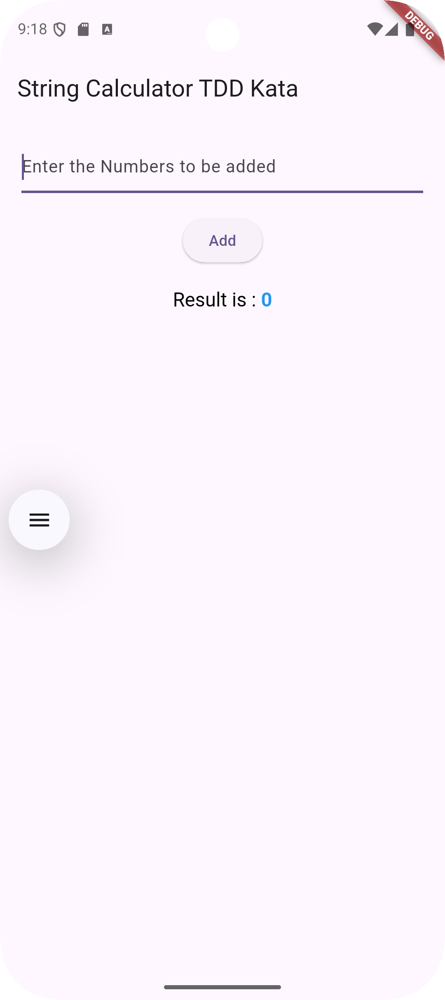

# string_calculator_tdd

A Dart/Flutter-based implementation of the classic **String Calculator Kata**, following Test-Driven Development (TDD) principles.

This repository walks through the various steps of the String Calculator Kata, with corresponding tests to ensure correctness and handle edge cases effectively.

## 📚 Problem Statement

Implement a calculator that takes a string of numbers separated by delimiters and returns their sum, following these progressive steps:

1️⃣ Create a simple String calculator with a method signature like this:
  input should be a string of comma-separated numbers and output an integer, sum of the numbers.
  For example :-
    -> Input: “”, Output: 0
    -> Input: “1”, Output: 1
    -> Input: “1,5”, Output: 6

2️⃣ Allow the add method to handle any amount of numbers.

3️⃣ Allow the add method to handle new lines between numbers (instead of commas). ("1\n2,3" should return 6)

4️⃣ Support different delimiters:
  -> To change the delimiter, the beginning of the string will contain a separate line that looks like this: "//[delimiter]\n[numbers…]". For example, "//;\n1;2" where the delimiter is ";" should return 3.

5️⃣ Calling add with a negative number will throw an exception: "negative numbers not allowed <negative_number>".

6️⃣ Numbers bigger than 1000 should be ignored, so adding 2 + 1001 = 2    

### Prerequisites

- Dart SDK or Flutter SDK
- A code editor

📁 Folder strucuture

├── lib/
│   ├── string_calculator.dart      # Main calculator logic
|   ├── main.dart                   # Minimal UI
├── test/
│   ├── step1_return_zero.dart
│   ├── step2_return_number.dart
│   ├── ...
├── pubspec.yaml

The main.dart file consits of the minimal UI of the `TextFormField`, `ElevatedButton` & `RichText`

Values are entered through a `TextFormField`, and when the `ElevatedButton` is pressed, the input is passed to the `add` method defined in `string_calculator.dart`. The method performs the calculation and returns the result, which is then stored in the `additionResult` variable and displayed using a `RichText` widget.

### Install Dependencies

`flutter pub get`

## Run all tests 

`flutter test`

## To run individual test

`flutter test test/step1_add_string_of_comma_separated_numbers.dart`

## 🧑‍💻 Implementation Overview

To accomplish this kata:

* I created a minimal Flutter UI in the `main.dart` file using a `TextFormField` for input, an `ElevatedButton` to trigger the operation, and a `RichText` widget to display the result.
* I encapsulated the core logic in a separate class called `StringCalculator`, following the Single Responsibility Principle.
* The class contains an `add` method that performs all the parsing and calculation.
* To manage different kinds of delimiters, I introduced two regular expressions:
  -> `commaNewLineRegEx` to handle default delimiters (`,` and `\n`)
  -> `customCommaRegEx` to detect and apply custom delimiters from input (e.g., `//;\n1;2`)

✅ Step 1: Basic Comma-Separated Inputs

  * Used `split(',')` to separate the numbers.
  * Parsed each number with `int.parse`.
  * Handled empty string by returning `0`.
  * Threw a `FormatException` for more than two numbers or if input starts/ends with a comma.

✅ Step 2: Support Any Amount of Numbers

  Removed the check that limited input to only two numbers.
  ```
  // Removed this check:
  // if (numbers.length > 2) {
  //   throw FormatException("Only up to 2 numbers are allowed");
  // }
  ```

✅ Step 3: Support Newline as Delimiter

  * Introduced a regular expression `commaNewLineRegEx = RegExp(r'[,\n]')` to handle both comma and newline.
  * Updated `split(delimiter)` to use the combined regex instead of just comma.
  * Enabled inputs like `"1\n2"` or `"1\n2,3"`.

✅ Step 4: Support Custom Delimiters

  * Introduced `customCommaRegEx = RegExp(r'^//(.+)\n(.*)$')` to detect custom delimiters.
  * If custom delimiter syntax is matched, used that character as the delimiter instead of default regex.
  * Escaped custom delimiters with `RegExp.escape(customDelimiter)` for safety.
  * Updated logic to extract the actual number section from the input.

✅ Step 5: Handle Negative Numbers

  * After parsing numbers, filtered negative values using: `final negatives = numbers.where((n) => n < 0).toList();`
  * If any negative numbers were found, threw a `FormatException` listing all of them:
    ```
    if (negatives.isNotEmpty) {
      throw FormatException("negative numbers not allowed: ${negatives.join(',')}");
    }
    ```

✅ Step 6: Ignore Numbers > 1000

  Applied a filter before summing to exclude numbers greater than 1000:

  `return numbers.where((currentValue) => currentValue <= 1000).fold(0, (initialValue, currentValue) => initialValue + currentValue);`

🧪 Test Coverage by Feature

✅ Step 1: Handling Basic Comma-Separated Inputs (`step1_add_string_of_comma_separated_numbers.dart`)

Implemented unit tests to verify that the `add` method correctly handles empty strings, single numbers, and comma-separated values. It also checks for invalid inputs like inputs starting or ending with a comma, or passing more than two numbers, which should throw appropriate exceptions.

✅ Step 2: Handling Any Number of Comma-Separated Inputs(`step2_add_any_amount_of_numbers..dart`)

Added tests to ensure the `add` method can handle any number of comma-separated numeric values. This includes inputs with more than two numbers (e.g., `1,2,3`) and even longer sequences (e.g., ten numbers), confirming that all are summed correctly without throwing exceptions.

✅ Step 3: Supporting New Line as a Delimiter(`step3_add_method_new_lines_between_numbers.dart`)

Enhanced the add method to support new lines (`\n`) as valid delimiters between numbers. Tests verify that combinations of commas and new lines (e.g., `1\n2`, `1\n3,5`, `1,3\n5`) are handled correctly, and the sum is computed as expected.

✅ Step 4: Supporting Custom Delimiters (`step4_support_different_delimiters.dart`

Enhanced the calculator to handle custom delimiters defined in the format `//<delimiter>\n<numbers>`. Tests verify the correct addition using various custom delimiters like `;`, `#`, and `-`. It also ensures that incorrectly formatted inputs (e.g., ending with a delimiter) throw a `FormatException`.

✅ Step 5: Handling Negative Numbers (`step5_adding_negative_number_will_throw_an_exception.dart`)

Implemented logic to detect negative numbers and throw a `FormatException`. If the input includes one or more negative values (including with custom delimiters), an exception is raised with all negative numbers listed in the error message. A passing test case is also included to ensure valid inputs without negatives still return the correct sum.

✅ Step 6: Ignoring Numbers Greater Than 1000 (`step6_numbers_bigger_than_1000_ignore.dart`)

Enhanced the logic to ignore any number greater than 1000 during summation. These numbers are treated as zero and do not affect the result. Tests confirm that 1000 is still included, while numbers like 1001 or 1234 are excluded from the total.

## 📸 Screenshots





